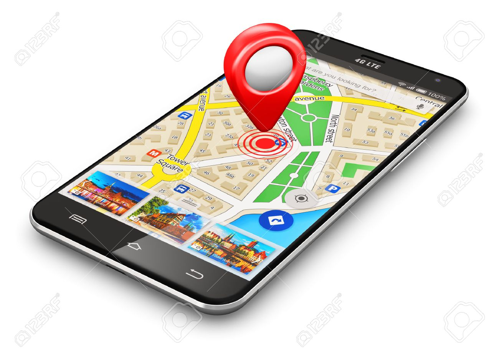
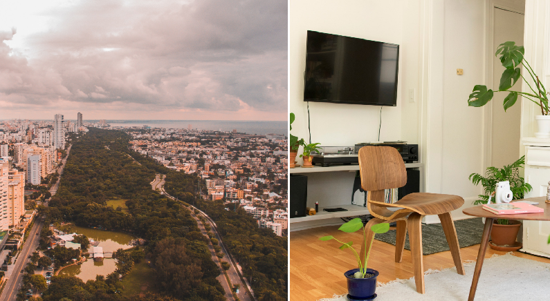
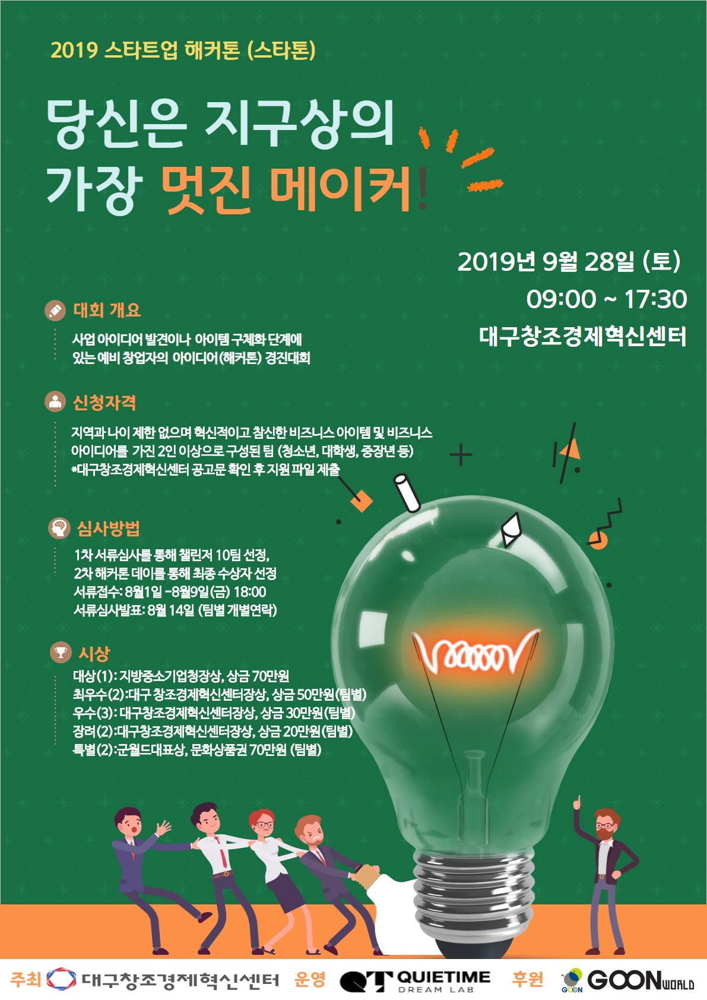

# AMT
Amatta application that reminds you not to loss your items

## Participant

* **Team Leader** : [Seongrok Kim](https://github.com/CasselKim)  

* **Main Director** : [Chiho Yoon](https://github.com/YoonChiHo)  

* **Developer** : [Junkie Lee](https://github.com/KNUjun), [Junbyung Lee](https://github.com/LJBang)  

* **Designer** : [Woojin Jang](https://github.com/WooJin16)  

.  

## Works

### GPS

### Swipe

### Notification

### IO Transition (Indoor/Outdoor)

.  

## Project Term  

2019.08.14 ~  

.  

## Enter

